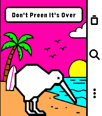
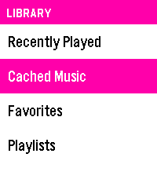
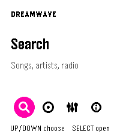
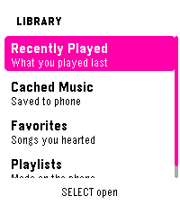
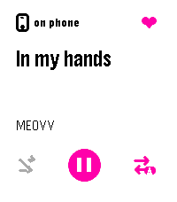

<div align="center">

# 🌊 dreamwave

**A music player for the Pebble Time 2** — browse, search and stream YouTube Music from your wrist, with audio routed to your phone *or* the watch's own speaker.

[](https://github.com/bleelblep/pt2-music-clean/releases/latest)
[](LICENSE)
[%20%2B%20Android-orange)](#building)

**Stock UI**

<p>
  
  
</p>

**Bespoke UI**

<p>
  
  
</p>

**Now Playing** *(shared by both UIs)*

<p>
  
</p>

</div>

## How it works

dreamwave is two halves that talk over Bluetooth LE via PebbleKit:

- **`watchapp/`** — a Pebble watchapp (C) that browses, searches and controls playback, with cover art, voice search, and an optional on-watch keyboard.
- **`pebble-companion/`** — a standalone Android app (`dev.pebble.musicbridge`) with a full player UI that resolves and streams audio, and bridges everything to the watch.

Audio can be routed two ways, switchable from either device:

| Route | What happens |
|---|---|
| 📱 **Phone** | The companion plays locally through a Media3 session |
| ⌚ **Watch** | PCM is downsampled, IMA-ADPCM encoded on the phone and streamed to the Time 2's speaker over BLE |

## Features

### ⌚ Watchapp
- Browse Home / Library, search YouTube Music (song, artist radio, song radio), full transport controls
- Cover-art display, progress bar, queue view
- Voice search by default; on-watch grid keyboard unlockable via **About → SELECT ×7 on the version row**
- Independent watch/phone volume, per-route audio quality, shuffle & loop sync, favorites & playlists
- Bespoke or stock UI, six themes, home styles, home quotes

**→ [In-depth watchapp docs](docs/watchapp.md)**

#### Defaults

A fresh install starts here. Everything is changeable in **Settings**, or **Settings → Advanced** once unlocked; nothing below is a one-way door.

| Setting | Default | Why |
|---|---|---|
| Bespoke UI | **On** | The language the app is designed in. The stock look is the fallback, not the baseline. |
| Keyboard | **Grid** | The 3×3 swipe keyboard suits the Time 2's touchscreen; Classic is there for muscle memory. |
| Progress bar | **On** | Now Playing's rail and its remaining/total chips both hang off this. Turning it off is the battery-saver layout — no rail, no times, no per-second redraw. |
| Back stops | **Off** | Backing out of Now Playing leaves the track playing, so Back is pure navigation and Home keeps its card. On restores the old teardown-on-exit behaviour. |
| History | **20 songs** | The maximum. Recently Played is cheap and the shorter list ran out quickly. |
| Results | **10** | Full page of search results rather than half of one. |
| Cache radio | **Off** | Radio is endless and effectively unrepeatable, so caching it spends the budget on the tracks you are least likely to hear again. |

Cover art is no longer a setting — it is always on. It was a toggle until 0.5.0, when the artwork became Now Playing's whole upper half and Home's card face; switching it off left both screens built around a hole.

### 📱 Companion
- Full player UI vendored from PixelPlayer — Home, Library, Search, Cache and Now Playing screens
- YouTube Music resolution via `innertube` + PipePipe Extractor
- On-phone cover-art encoding for the watch (Go `watchimagebridge`, bound via gomobile)
- Versioned watch wire protocol with capability negotiation and conflict-free route switching
- Foreground media service with notification controls, on-device stream cache, resume positions

**→ [In-depth companion docs](docs/companion.md)**

## Layout

| Path | What it is |
|---|---|
| `watchapp/` | Pebble C app, built with the Pebble SDK (targets `emery`) |
| `watchapp/lib/grid_keyboard/` | Self-contained 3×3 swipe keyboard for text entry |
| `pebble-companion/` | Android companion app — playback, streaming, PebbleKit transport |
| `innertube/` | YouTube Music API client, from Metrolist (GPL-3.0) |
| `watchimage-bridge/` | Go source for `watchimagebridge.aar` (cover-art encoding) |
| `docs/` | In-depth docs: [watchapp](docs/watchapp.md), [companion](docs/companion.md) |
| `licenses/` | Full license texts for all upstreams |

## Install

Grab both artifacts from the [latest release](https://github.com/bleelblep/pt2-music-clean/releases/latest):

1. Install the **APK** on the Android phone paired to your Pebble.
2. Install the **PBW** through the Pebble app.

## Building

### Android companion

```bash
./gradlew :pebble-companion:assembleDebug
```

Output lands in `pebble-companion/build/outputs/apk/debug/`.

`pebble-companion/libs/watchimagebridge.aar` is checked in as a build input. To rebuild it from source you need Go and `gomobile`:

```bash
cd watchimage-bridge
gomobile bind -target=android/arm64 -androidapi 26 \
  -javapkg dev.pebble.watchimagebridge \
  -o ../pebble-companion/libs/watchimagebridge.aar watchimagebridge
```

### Watchapp

Requires the [Pebble SDK](https://github.com/google/pebble) (tested with Pebble Tool 5.0.39 / SDK 4.17):

```bash
cd watchapp
npm install
pebble build
pebble install --phone <ip>
```

## Built on the shoulders of

| | Project | Role | License |
|---|---|---|---|
| [](https://github.com/MetrolistGroup/Metrolist) | Metrolist | `innertube/` API client; foundation the companion derives from | GPL-3.0 |
| [](https://github.com/maxrave-dev/PipePipeExtractor) | PipePipe Extractor | YouTube search & stream extraction | GPL-3.0 |
| [](https://github.com/PixelPlayerHQ/PixelPlayer) | PixelPlayer | Player UI (vendored at `39030156`, the last MIT commit) | MIT |
| [](https://github.com/killdano/mirrormsg) | mirrormsg / watchimage | Cover-art encoding pipeline | AGPL-3.0 |
| [](https://github.com/pebble-dev/PebbleKitAndroid2) | PebbleKit / Rebble | Watch ↔ Android communication | Apache-2.0 |
| [](https://github.com/google/pebble) | Pebble SDK | Watchapp toolchain | Apache-2.0 |
| [](https://github.com/vgmoose/tertiary_text) | Tertiary Text | Keyboard concept | MIT |
| [](https://github.com/TypeNetwork/Roboto-Flex) | Roboto Flex | Companion typeface | OFL-1.1 |

Full attribution and all license texts: [`THIRD_PARTY_NOTICES.md`](THIRD_PARTY_NOTICES.md) and [`licenses/`](licenses/).

## Licensing

This project as a whole is **AGPL-3.0-or-later** — see [`LICENSE`](LICENSE).

It is derived from [Metrolist](https://github.com/MetrolistGroup/Metrolist) (GPL-3.0-or-later) and links [mirrormsg/watchimage](https://github.com/killdano/mirrormsg) (AGPL-3.0-or-later). GPL-3.0 and AGPL-3.0 are compatible, but the combined work is governed by the stricter AGPL terms, so that is what applies here. Files originating from GPL-3.0 upstreams keep their original terms; only the combined work is distributed under AGPL-3.0.
